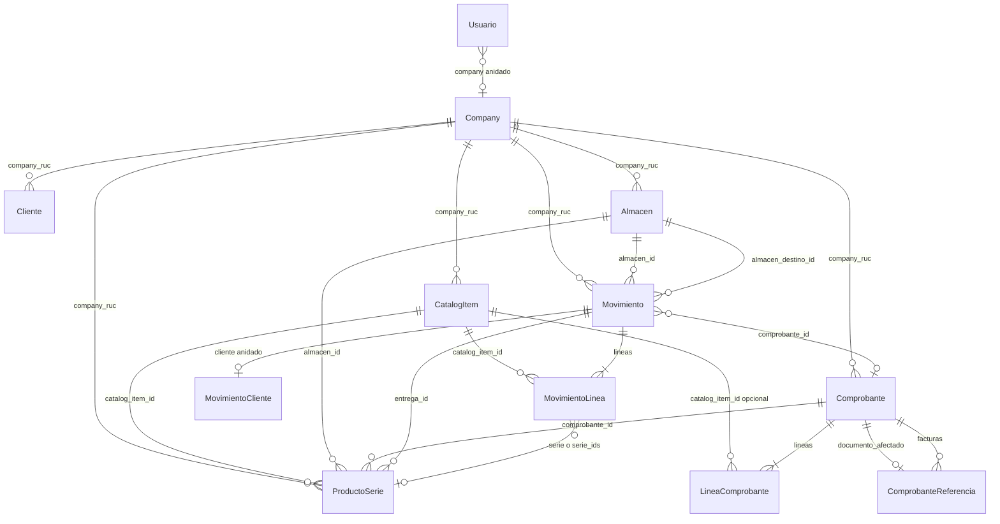

# Modelo relacional (desde DTOs `network/dto`)

Documento alineado **solo** con los `data class` del API.  
Excel detallado: [`modelo_relacional_desde_dtos.xlsx`](modelo_relacional_desde_dtos.xlsx)

---

## Entidades principales (persistibles en API)

| Entidad | Clave | Aislamiento |
|---------|-------|-------------|
| **Company** | `ruc` | Tenant |
| **Usuario** | `email` | Trae `company` anidado en login |
| **Cliente** | `id` | `company_ruc` |
| **CatalogItem** | `id` | `company_ruc` |
| **Almacen** | `id` | `company_ruc` |
| **ProductoSerie** | `id` | `company_ruc` + `catalog_item_id` |
| **Movimiento** | `id` | `company_ruc` + `lineas[]` |
| **Comprobante** | `id` | `company_ruc` + `lineas[]` |

---

## Diagrama ER (relaciones)



---

## Objetos anidados (no son tablas en el JSON)

| Dentro de | Objeto | Campos |
|-----------|--------|--------|
| `Comprobante` | `ComprobanteReceptor` | tipo_doc, numero_doc, razon_social |
| `Comprobante` | `ComprobanteTotales` | subtotal, igv, total, moneda |
| `Comprobante` | `ComprobanteReferencia` | tipo, serie, numero, fecha_emision |
| `Movimiento` | `MovimientoCliente` | tipo_doc, numero_doc, razon_social? |

En base de datos puedes **aplanar** esas columnas en la tabla padre o normalizar; el DTO los envía **anidados**.

---

## Arrays = relación 1:N

| Padre | Hijo | JSON |
|-------|------|------|
| `Movimiento` | `MovimientoLinea` | `lineas` |
| `Comprobante` | `LineaComprobante` | `lineas` |
| `Comprobante` | `ComprobanteReferencia` | `facturas` (guía) |
| `EventoVidaProducto` | `EventoVidaLineaDetalle` | `lineas_movimiento` |

---

## No está en los DTOs del API

| Concepto | Realidad en la app |
|----------|-------------------|
| `LineaCatalogoItem` | Solo UI; se convierte a `EmitirLineaRequest` / `RegistrarMovimientoLineaRequest` |
| `EventoVidaProducto` | DTO existe; **no hay** `GET` en `ApiService`; se arma desde `Movimiento` |
| `stock_actual` | Campo de lectura en `CatalogItem`; depende de `?almacen_id=` |
| FK `Cliente` → `Comprobante` | **No**: `receptor` es copia de datos, no `cliente.id` |
| Compras vs ventas | Mismo `Comprobante`; rutas distintas (`/comprobantes` vs `/compras`) |

---

## Cardinalidades (resumen)

| Origen | | Destino | Enlace |
|--------|---|---------|--------|
| Company | 1:N | Cliente, CatalogItem, Almacen, Comprobante, Movimiento, ProductoSerie | company_ruc |
| CatalogItem | 1:N | ProductoSerie, MovimientoLinea | catalog_item_id |
| Almacen | 1:N | Movimiento (origen/destino), ProductoSerie | almacen_id |
| Movimiento | 1:N | MovimientoLinea | lineas |
| Movimiento | N:1 | Comprobante (opc.) | comprobante_id |
| Comprobante | 1:N | LineaComprobante | lineas |
| Comprobante | 1:N | ComprobanteReferencia | facturas[] |
| Comprobante | 1:1 | ComprobanteReferencia (opc.) | documento_afectado |

---

## Regenerar Excel

```bash
python docs/generar_modelo_dto_excel.py
```
